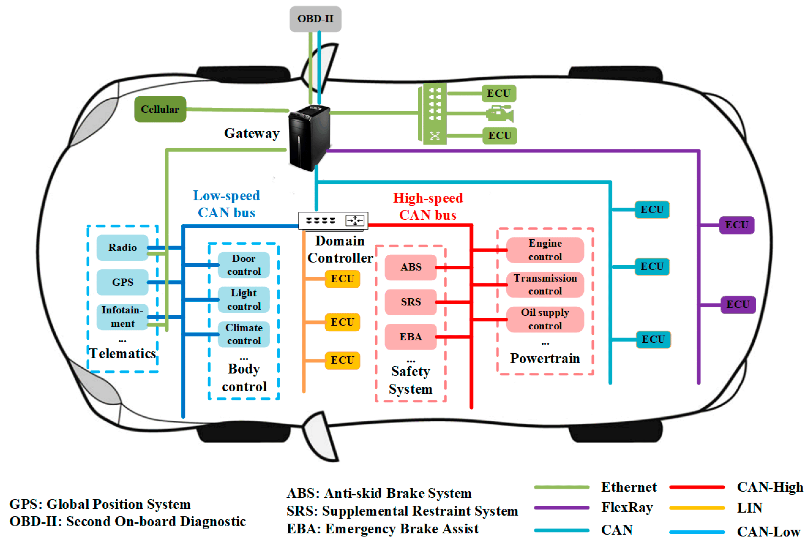
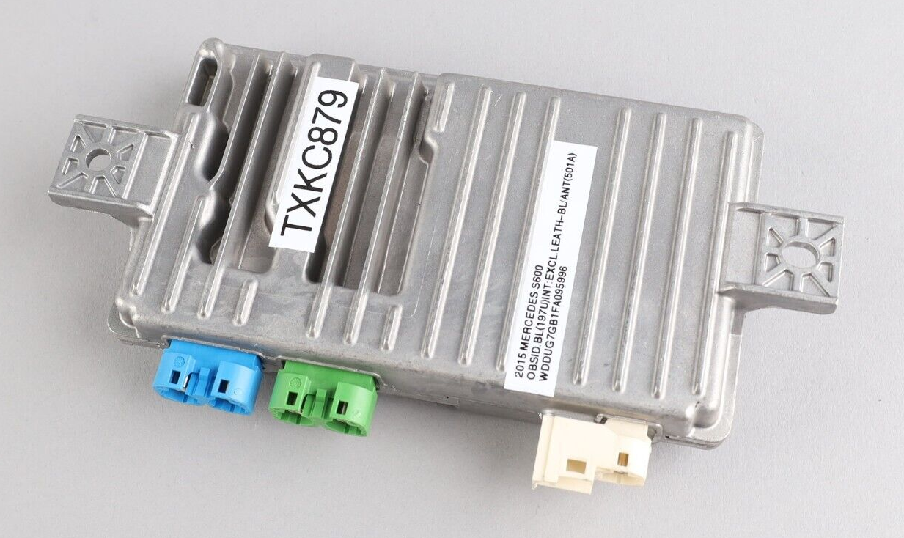
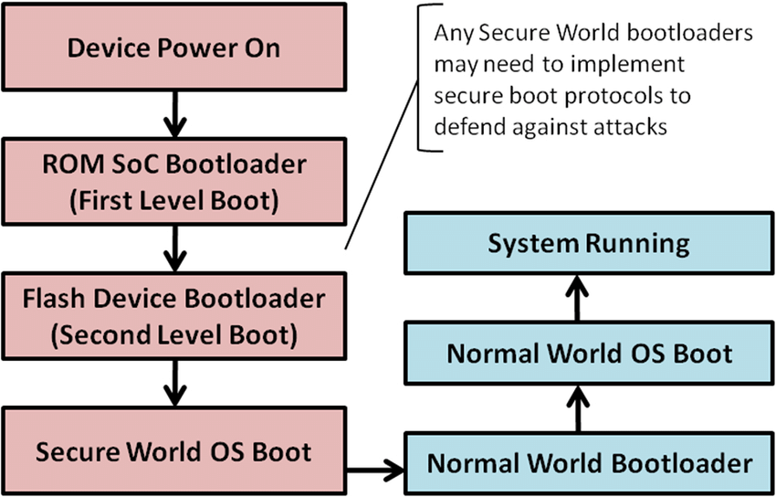
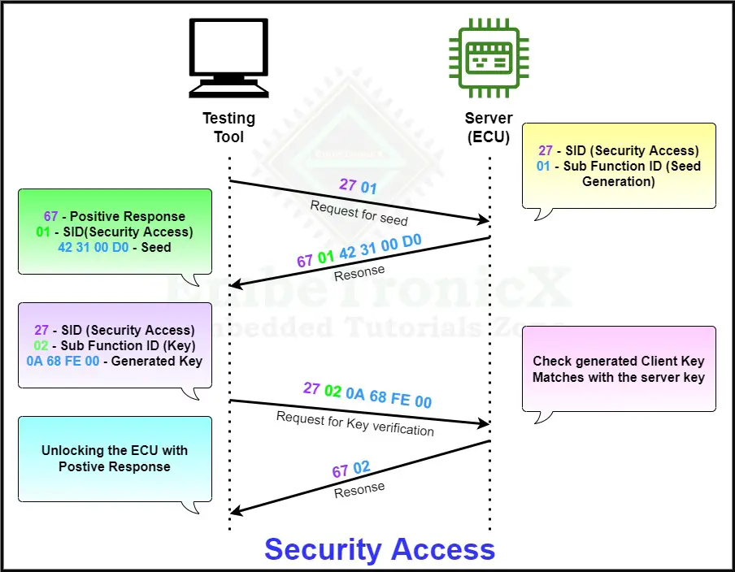

# A Dive-in Automotive Security

## Motivation

The automotive domain remains significantly underrepresented in online discussions, a phenomenon that may be attributed to the industry's tendency to operate discreetly without openly sharing insights, solutions, and methodologies. This discretion could be attributed to the prevalence of proprietary tools and solutions that are not intended for widespread online dissemination. Moreover, the high cost associated with these tools and solutions often renders them unattainable for individual enthusiasts. Within this context, one notable area that remains sparsely explored on the internet pertains to the security landscape of embedded systems, particularly within the automotive sector.

This article aims to elucidate fundamental concepts critical for effective cyber security implementation in automotive software destined for Electronic Control Units (ECUs) within vehicles.

## Basic Automotive Concepts

### What Does the Car Look-like from Inside?

Looking inside a modern car, you'll find a complex blend of technology. The car's insides resemble a network where different parts, called zoned-architected Electronic Control Units (ECUs), talk to each other. These ECUs are spread throughout the car and work together to control lots of things like how the engine runs, how safe the car is, and even stuff like entertainment and helping the driver. This setup shows how the car's software is really intricate, and these ECUs need to talk well to keep the car running smoothly. Making sure they're secure is super important to keep the car working right and safe for everyone.

#### ECU Network and Organization

Examining the following image, you'll notice that the car houses numerous ECUs, grouped strategically based on factors such as safety, security, and functionality. It's important to emphasize that the car's engine compartment functions as a network of ECUs, which interact using communication buses like CAN bus, as well as occasionally using other buses like LIN, Ethernet, and more. The following diagram shows an abstraction of how this network might look-like.

*Image dredits: Article - [CANsec: A Practical in-Vehicle Controller Area Network Security Evaluation Tool.](https://www.mdpi.com/1424-8220/20/17/4900)*

#### What's an ECU?

From a software embedded system perspective, an Electronic Control Unit (ECU) in a car acts as the brain behind some functions. It's like a mini-computer that interprets data from sensors and makes decisions to optimize how the car works. Each ECU has a specific job, like managing the engine, brakes, or infotainment. They work together like a team, communicating to ensure the car runs smoothly and safely. Just like apps on a phone, ECUs have their own software that needs to be secure and reliable to keep the car operating effectively. The following picture is taken from e-Bay, it is an ECU for Mercedes W222 S600 S550 Rear View Camera Control Module.

Image credits: E-Bay - [14-17 Mercedes W222 S600 S550 Rear View Camera Control Module 0009001307 OEM 86k](https://www.ebay.com/itm/145223255891)

#### What's Controller Area Network (CAN)?

The Controller Area Network (CAN) is a communication protocol that enables different parts of a car to talk to each other effectively. It's like the car's internal messaging system. CAN helps ECUs share information, like speed and engine status, quickly and reliably. There are different versions of CAN used in cars today, such as CAN 2.0A and CAN 2.0B. CAN is widely used in automotive systems because it's robust, efficient, and can handle the real-time demands of a car's operations. It's a bit like how team members in a race need to communicate instantly and flawlessly to win the race – CAN ensures that the different parts of the car work together seamlessly to provide a safe and smooth driving experience.

#### Why is CAN used a lot in cars?

The inception of the CAN protocol was driven by the specific requirements of early automotive systems, with an emphasis on simplicity and reliability. This was particularly relevant for applications such as engine control and diagnostics. Car systems is designed with determinism in mind, relying on a predictable pattern of frames and messages. CAN effectively catered to this need through its priority-based message arbitration scheme, ensuring messages with higher priority were transmitted first.

CAN's broadcasting feature aligned well with automotive networks, simplifying the network structure by resembling a bus. In this setup, related ECUs were connected to the same bus, eliminating the need for complex routing schemes. Messages, broadcasted with specified priorities, prompted the relevant ECUs to respond appropriately.

In essence, CAN's suitability stemmed from its trifecta of advantages: simplicity in design, real-time responsiveness, and deterministic behavior. These qualities made CAN an ideal choice for automotive systems, effectively addressing the demands of such systems.

## Automotive Security Disciplines

### Secure Booting

Secure booting is a fundamental aspect of ensuring the integrity and safety of Electronic Control Units (ECUs) and Automotive System-on-Chips (SoCs). The booting sequence, starting from Read-Only Memory (ROM) up to the application layer, is a critical process that demands protection against unauthorized or malicious modifications.

*Image credits: [Boot sequence of ARM TrustZone processors](https://www.researchgate.net/figure/Boot-sequence-of-ARM-TrustZone-processors_fig4_340164480)*

#### Root of Trust

The concept of a "Root of Trust" serves as the foundation for secure booting. This involves establishing a trusted and unalterable starting point within the ECU or SoC, often rooted in hardware. This root of trust acts as a reference point, assuring that subsequent software components are genuine and untampered. It can be seen as a ROM bootloader that is always checking the next secondary bootloader (firmware) that will execute and run the application eventually.

#### Authentication of Firmware at Booting

Cryptographic techniques, like digital signatures and hash functions, are key elements in secure booting. Digital signatures verify the authenticity of the software components using cryptographic keys, while hash functions validate their integrity. This layered approach ensures that only authorized and unmodified software can proceed through the booting process, effectively safeguarding the ECU or SoC against potential security breaches.

#### Decryption of Firmware at Booting

An additional (sometimes optional) layer of protection is introduced through firmware decryption. Encrypted firmware is read during booting and decrypted using cryptographic keys stored in the root of trust. This step maintains confidentiality and safeguards sensitive code and data. Firmware decryption, combined with secure booting, forms a robust defense that not only verifies software authenticity and integrity but also shields it from unauthorized access. This comprehensive strategy enhances automotive security by thwarting a wide range of threats and safeguarding the intricate software landscape of modern vehicles.

#### Last Words About Secure Booting

In essence, secure booting establishes a robust defense against unauthorized software modifications, guaranteeing the trustworthiness and reliability of automotive ECUs and SoCs, contributing to the overall cyber security posture of modern vehicles.

### Secure/Authenticated Diagnostics

#### What's Diagnostics?

Diagnostics in the context of automotive electronics refers to the process of identifying, analyzing, and troubleshooting issues within the vehicle's electronic systems. It plays a pivotal role in maintaining optimal vehicle performance, ensuring safety, and facilitating efficient repairs.

The importance of diagnostics cannot be understated, as it enables mechanics and technicians to pinpoint problems swiftly and accurately, reducing downtime and enhancing vehicle reliability. However, the critical nature of these diagnostics data necessitates protection against unauthorized access and potential misuse.

#### Secure Authentication Sequence for Diagnostics

To address this concern, authentication mechanisms are implemented within Electronic Control Units (ECUs) and Automotive System-on-Chips (SoCs). For instance, in the ISO Unified Diagnostic Services (UDS) protocol, service requests like 0x27 (Security Access) and 0x29 (Seed & Key) are employed. These involve a sequence where the requesting entity proves its legitimacy, gaining access only if it successfully follows the established authentication process.

Another layer of security involves the utilization of a random seed. During communication between the diagnostic tool and the UDS server within the ECU, a random seed is exchanged. This seed serves as a basis for generating cryptographic keys, ensuring that only authorized parties with the correct seed can access and manipulate the diagnostics data.

The following sequence diagram shows an example of using the service (0x27 - Security Access) and its sub-services (0x1 - Request Seed) and (0x2 - Send Key) for the ECU to authenticate the tool and allow it to get some sensitive data using the other diagnostics services.

The sequnece is as follows:

1. Testing tool requests a seed from the ECU.
2. ECU respondes with Random Number generated inside it.
3. Testing tool does a cryptographic operation on the key and re-sends it to the ECU.
4. The server in the ECU, does the same cryptographic operation and make sure that the same output is expected from the testing tool.
5. Once the result of this sequence is as expected, the ECU grants this testing tool access to the configured services. Otherwise, it will reject the authentication.

Image credits: [Diagnostics and Communication Management function group -UDS](https://embetronicx.com/tutorials/automotive/uds-protocol/diagnostics-and-communication-management/)

### Secure Communication

Securing communication within Electronic Control Units (ECUs) and Automotive System-on-Chips (SoCs) is paramount due to the critical role it plays in vehicle safety and functionality. Ensuring that data exchanged between different components remains confidential, untampered, and authentic is essential for safeguarding against potential threats.

#### Non-secure Communication Attacks

Various attacks can be executed on communication systems, ranging from eavesdropping and message manipulation to unauthorized access and injection of malicious code. These attacks can disrupt vehicle operations, compromise safety features, and even lead to severe incidents.

Notable real-world incidents exemplify the importance of communication security. Attacks on the Controller Area Network (CAN) protocol, a widely used communication standard in vehicles, have demonstrated vulnerabilities that can be exploited. For instance, researchers showcased how they could manipulate CAN messages to manipulate vehicle functions, such as disabling brakes or altering steering, emphasizing the need for robust security measures.

#### How to Protect the Communication

To counter these threats, multiple mechanisms are employed.

1. Encryption ensures that data exchanged between components remains confidential and cannot be easily intercepted.
2. Digital signatures and authentication mechanisms verify the authenticity of messages, guaranteeing their origin and integrity.
3. Access controls restrict communication to authorized entities, preventing unauthorized devices from interfering.

#### Securing the CAN Protocol

Securing the CAN protocol itself involves techniques like [message authentication codes (MACs)](https://etd.lib.metu.edu.tr/upload/12625136/index.pdf) and intrusion detection systems. MACs ensure that transmitted messages remain unmodified, while intrusion detection systems monitor network behavior and identify anomalies that might indicate an ongoing attack.

### Secure Programming/Updating

### Secure Data Storage

### Secure Hardware Pairing

### Secure OS

### Isolation and Resource Protection

#### Network Segmentation

### ECU Life Cycle

#### OTP

#### Security Hardening

### Secure Debugging

## Readings

[1] [Diagnostics and Communication Management function group -UDS](https://embetronicx.com/tutorials/automotive/uds-protocol/diagnostics-and-communication-management/)

[2] [Secure Message Authentication Protocol for CAN - MIDDLE EAST TECHNICAL UNIVERSITY](https://etd.lib.metu.edu.tr/upload/12625136/index.pdf)
