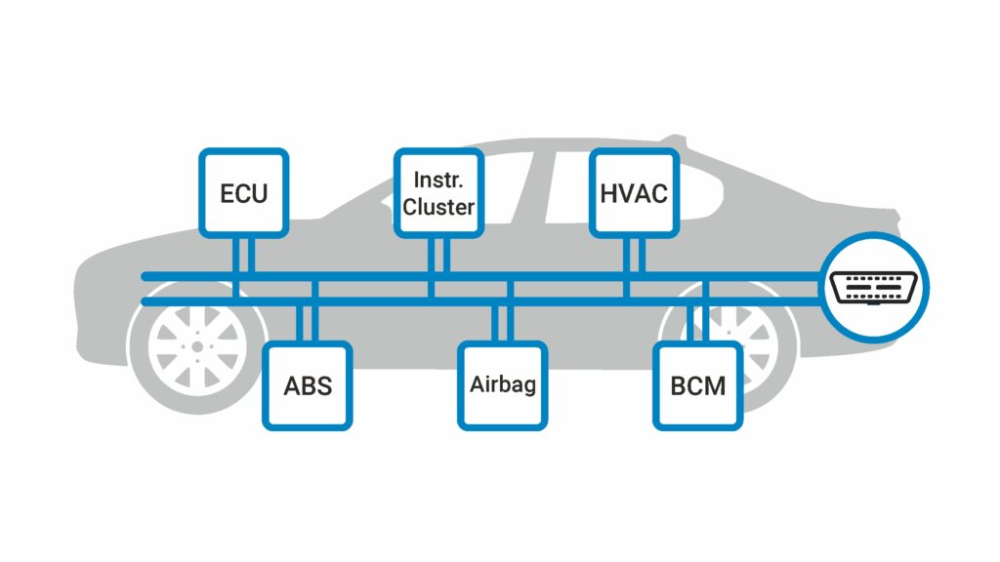

# A Dive-in Automotive Security

## 1. Motivation

The automotive domain remains significantly underrepresented in online discussions, a phenomenon that may be attributed to the industry's tendency to operate discreetly without openly sharing insights, solutions, and methodologies. This discretion could be attributed to the prevalence of proprietary tools and solutions that are not intended for widespread online dissemination. Moreover, the high cost associated with these tools and solutions often renders them unattainable for individual enthusiasts. Within this context, one notable area that remains sparsely explored on the internet pertains to the security landscape of embedded systems, particularly within the automotive sector.

This article aims to elucidate fundamental concepts critical for effective cyber security implementation in automotive software destined for Electronic Control Units (ECUs) within vehicles.

## 2. Basic Automotive Concepts

### 2.1. What Does the Car Look-like from Inside?

Looking inside a modern car, you'll find a complex blend of technology. The car's insides resemble a network where different parts, called zoned-architected Electronic Control Units (ECUs), talk to each other. These ECUs are spread throughout the car and work together to control lots of things like how the engine runs, how safe the car is, and even stuff like entertainment and helping the driver. This setup shows how the car's software is really intricate, and these ECUs need to talk well to keep the car running smoothly. Making sure they're secure is super important to keep the car working right and safe for everyone.

#### 2.1.1. ECU Network and Organization

Examining the following image, you'll notice that the car houses numerous ECUs, grouped strategically based on factors such as safety, security, and functionality. It's important to emphasize that the car's engine compartment functions as a network of ECUs, which interact using communication buses like CAN bus, as well as occasionally using other buses like LIN, Ethernet, and more. The following diagram shows an abstraction of how this network might look-like.

*Image dredits: Article - [CANsec: A Practical in-Vehicle Controller Area Network Security Evaluation Tool.](https://www.mdpi.com/1424-8220/20/17/4900)*

#### 2.1.2. What's an ECU?

From a software embedded system perspective, an Electronic Control Unit (ECU) in a car acts as the brain behind some functions. It's like a mini-computer that interprets data from sensors and makes decisions to optimize how the car works. Each ECU has a specific job, like managing the engine, brakes, or infotainment. They work together like a team, communicating to ensure the car runs smoothly and safely. Just like apps on a phone, ECUs have their own software that needs to be secure and reliable to keep the car operating effectively. The following picture is taken from e-Bay, it is an ECU for Mercedes W222 S600 S550 Rear View Camera Control Module.

Image credits: E-Bay - [14-17 Mercedes W222 S600 S550 Rear View Camera Control Module 0009001307 OEM 86k](https://www.ebay.com/itm/145223255891)

#### 2.1.3. What's Controller Area Network (CAN)?

The Controller Area Network (CAN) is a communication protocol that enables different parts of a car to talk to each other effectively. It's like the car's internal messaging system. CAN helps ECUs share information, like speed and engine status, quickly and reliably. There are different versions of CAN used in cars today, such as CAN 2.0A and CAN 2.0B. CAN is widely used in automotive systems because it's robust, efficient, and can handle the real-time demands of a car's operations. It's a bit like how team members in a race need to communicate instantly and flawlessly to win the race – CAN ensures that the different parts of the car work together seamlessly to provide a safe and smooth driving experience.

#### 2.1.4. Why is CAN used a lot in cars?

The inception of the CAN protocol was driven by the specific requirements of early automotive systems, with an emphasis on simplicity and reliability. This was particularly relevant for applications such as engine control and diagnostics. Car systems is designed with determinism in mind, relying on a predictable pattern of frames and messages. CAN effectively catered to this need through its priority-based message arbitration scheme, ensuring messages with higher priority were transmitted first.

CAN's broadcasting feature aligned well with automotive networks, simplifying the network structure by resembling a bus. In this setup, related ECUs were connected to the same bus, eliminating the need for complex routing schemes. Messages, broadcasted with specified priorities, prompted the relevant ECUs to respond appropriately.

In essence, CAN's suitability stemmed from its trifecta of advantages: simplicity in design, real-time responsiveness, and deterministic behavior. These qualities made CAN an ideal choice for automotive systems, effectively addressing the demands of such systems.

## 2.2. Automotive Security Disciplines

### 2.2.1. Secure Booting

Secure booting is a fundamental aspect of ensuring the integrity and safety of Electronic Control Units (ECUs) and Automotive System-on-Chips (SoCs). The booting sequence, starting from Read-Only Memory (ROM) up to the application layer, is a critical process that demands protection against unauthorized or malicious modifications.

*Image credits: [Boot sequence of ARM TrustZone processors](https://www.researchgate.net/figure/Boot-sequence-of-ARM-TrustZone-processors_fig4_340164480)*

#### 2.2.1.1. Root of Trust

The concept of a "Root of Trust" serves as the foundation for secure booting. This involves establishing a trusted and unalterable starting point within the ECU or SoC, often rooted in hardware. This root of trust acts as a reference point, assuring that subsequent software components are genuine and untampered. It can be seen as a ROM bootloader that is always checking the next secondary bootloader (firmware) that will execute and run the application eventually.

#### 2.2.1.2. Authentication of Firmware at Booting

Cryptographic techniques, like digital signatures and hash functions, are key elements in secure booting. Digital signatures verify the authenticity of the software components using cryptographic keys, while hash functions validate their integrity. This layered approach ensures that only authorized and unmodified software can proceed through the booting process, effectively safeguarding the ECU or SoC against potential security breaches.

#### 2.2.1.3. Decryption of Firmware at Booting

An additional (sometimes optional) layer of protection is introduced through firmware decryption. Encrypted firmware is read during booting and decrypted using cryptographic keys stored in the root of trust. This step maintains confidentiality and safeguards sensitive code and data. Firmware decryption, combined with secure booting, forms a robust defense that not only verifies software authenticity and integrity but also shields it from unauthorized access. This comprehensive strategy enhances automotive security by thwarting a wide range of threats and safeguarding the intricate software landscape of modern vehicles.

#### 2.2.1.4. Last Words About Secure Booting

In essence, secure booting establishes a robust defense against unauthorized software modifications, guaranteeing the trustworthiness and reliability of automotive ECUs and SoCs, contributing to the overall cyber security posture of modern vehicles.

### 2.2.2. Secure/Authenticated Diagnostics

#### 2.2.2.1. What's Diagnostics?

Diagnostics in the context of automotive electronics refers to the process of identifying, analyzing, and troubleshooting issues within the vehicle's electronic systems. It plays a pivotal role in maintaining optimal vehicle performance, ensuring safety, and facilitating efficient repairs.

The importance of diagnostics cannot be understated, as it enables mechanics and technicians to pinpoint problems swiftly and accurately, reducing downtime and enhancing vehicle reliability. However, the critical nature of these diagnostics data necessitates protection against unauthorized access and potential misuse.

#### 2.2.2.2. Secure Authentication Sequence for Diagnostics

To address this concern, authentication mechanisms are implemented within Electronic Control Units (ECUs) and Automotive System-on-Chips (SoCs). For instance, in the ISO Unified Diagnostic Services (UDS) protocol, service requests like 0x27 (Security Access) and 0x29 (Seed & Key) are employed. These involve a sequence where the requesting entity proves its legitimacy, gaining access only if it successfully follows the established authentication process.

Another layer of security involves the utilization of a random seed. During communication between the diagnostic tool and the UDS server within the ECU, a random seed is exchanged. This seed serves as a basis for generating cryptographic keys, ensuring that only authorized parties with the correct seed can access and manipulate the diagnostics data.

The following sequence diagram shows an example of using the service (0x27 - Security Access) and its sub-services (0x1 - Request Seed) and (0x2 - Send Key) for the ECU to authenticate the tool and allow it to get some sensitive data using the other diagnostics services.

The sequnece is as follows:

1. Testing tool requests a seed from the ECU.
2. ECU respondes with Random Number generated inside it.
3. Testing tool does a cryptographic operation on the key and re-sends it to the ECU.
4. The server in the ECU, does the same cryptographic operation and make sure that the same output is expected from the testing tool.
5. Once the result of this sequence is as expected, the ECU grants this testing tool access to the configured services. Otherwise, it will reject the authentication.

Image credits: [Diagnostics and Communication Management function group -UDS](https://embetronicx.com/tutorials/automotive/uds-protocol/diagnostics-and-communication-management/)

### 2.2.3. Secure In-Vehicle Communication

Securing communication within Electronic Control Units (ECUs) and Automotive System-on-Chips (SoCs) is paramount due to the critical role it plays in vehicle safety and functionality. Ensuring that data exchanged between different components remains confidential, untampered, and authentic is essential for safeguarding against potential threats.

#### 2.2.3.1. Non-secure Communication Attacks

Various attacks can be executed on communication systems, ranging from eavesdropping and message manipulation to unauthorized access and injection of malicious code. These attacks can disrupt vehicle operations, compromise safety features, and even lead to severe incidents.

Notable real-world incidents exemplify the importance of communication security. Attacks on the Controller Area Network (CAN) protocol, a widely used communication standard in vehicles, have demonstrated vulnerabilities that can be exploited. For instance, researchers showcased how they could manipulate CAN messages to manipulate vehicle functions, such as disabling brakes or altering steering, emphasizing the need for robust security measures.

#### 2.2.3.2. How to Protect the Communication

To counter these threats, multiple mechanisms are employed.

1. Encryption ensures that data exchanged between components remains confidential and cannot be easily intercepted.
2. Digital signatures and authentication mechanisms verify the authenticity of messages, guaranteeing their origin and integrity.
3. Access controls restrict communication to authorized entities, preventing unauthorized devices from interfering.

#### 2.2.3.3. Message Authentication of the CAN Protocol

Securing the CAN protocol itself involves techniques like [message authentication codes (MACs)](https://etd.lib.metu.edu.tr/upload/12625136/index.pdf) and intrusion detection systems. MACs ensure that transmitted messages remain unmodified, while intrusion detection systems monitor network behavior and identify anomalies that might indicate an ongoing attack.

### 2.2.4. Secure Programming/Updating

Programming and updating firmware within Electronic Control Units (ECUs) and Automotive System-on-Chips (SoCs) are essential for maintaining and enhancing vehicle functionality. Different programming models are used to update firmware, such as Over-The-Air (OTA) updates and dealer-specific reprogramming tools, facilitating flexibility and efficiency.

Usually the OTA updates are the most used model, to push new updates for the firmware (fixing bugs, adding new features, fixing security vulnerabilities, ..etc). As shown in the below diagram, the process of the OTA updates are pushed from a server repository that will eventually pass the new firmwares and update instructions to the telematics board in the car that will handle downloading all the firmwares for all ECUs that are marked to be updated. Once this happens the Telematics board will command the gateway boards to manage the ECU flashing, usually this flashing is done via (CAN or Ethernet).

Image credits: [Software Over the Air Update for Modern Software Architecture - The University of Michigan-Dearborn](https://designthesolution.org/wp-content/uploads/2022/09/Secure-Software-Update-in-Automotive-Modern-Software-Architecture-Student-Paper.pdf)

#### 2.2.4.1. Security Risks of Firmware Programming

However, the updating process is not without risks. Cyber threats, such as unauthorized access, malware injection, and data corruption, can potentially compromise the ECU's functionality, safety, and privacy. Ensuring the security of the updating process is paramount to mitigate these risks.

#### 2.2.4.2. Secure Programming Methods

Securing software updates involves a combination of measures. Cryptographic mechanisms, like **digital signatures**, can verify the authenticity and integrity of the incoming firmware, ensuring it hasn't been tampered with during transmission. **Authentication protocols** guarantee that only authorized parties can initiate updates (same technique explained in secure diagnostics section), preventing malicious entities from interfering. Secure booting, as discussed earlier, establishes a trusted starting point for the update process, ensuring the firmware's legitimacy.

Additionally, implementing strict access controls and following industry best practices during the programming and updating process minimizes vulnerabilities. Regular security audits, code reviews, and adherence to established security standards contribute to a comprehensive security posture.

By integrating these security practices, the automotive industry ensures that programming and updating processes remain robust, reducing the risk of potential breaches and enhancing the overall safety and reliability of vehicles on the road.

### 2.2.5. Secure Data Storage

Securing data storage within Electronic Control Units (ECUs) and Automotive System-on-Chips (SoCs) is pivotal to protect sensitive information and preserve intellectual property. Different types of data require specific security measures to ensure compliance with regulations and safeguard valuable assets.

#### 2.2.5.1. Types of Data Needs to Be Encrypted

For instance, user information, in accordance with privacy standards like GDPR, demands encryption to prevent unauthorized access and maintain individuals' privacy. Encryption transforms data into an unreadable format unless accessed with the appropriate decryption key, ensuring that personal information remains confidential.

On the other hand, intellectual property like AI models, algorithms, and proprietary software requires safeguarding against unauthorized copying or tampering. Implementing access controls, encryption, and secure booting mechanisms helps protect these valuable assets from potential threats and unauthorized usage.

### 2.2.6. Secure Hardware Pairing

Implementing secure hardware pairing is a pivotal step in strengthening the security and performance of Electronic Control Units (ECUs). Neglecting the proper pairing of hardware components can expose vehicles to an array of security vulnerabilities, including unauthorized access, potential data breaches, and operational malfunctions.

Through secure hardware pairing, a robust and trusted connection is established between hardware components. This ensures that they collaborate seamlessly in a verified and authenticated manner. By preventing unauthorized devices or components from interfacing with critical systems, the risk of tampering, data manipulation, and malicious attacks is significantly reduced.

For end users, the advantages of secure hardware pairing are manifest. A well-paired hardware system assures users of a vehicle's seamless and intended functionality. This instills confidence in both the safety of the vehicle and the privacy of sensitive data. Ultimately, embracing secure hardware pairing contributes to bolstering the cybersecurity landscape of vehicles, fostering consumer trust in automotive technology and the industry as a whole.

### 2.2.7. Secure OS

The security of Operating Systems (OS) within ECUs is paramount due to their central role in managing vehicle functions. A compromised OS can open the door to a range of attacks, including unauthorized access, data breaches, and remote control of critical systems, posing significant risks to vehicle safety and user privacy.

#### 2.2.7.1. Levels of OS Security

Securing the OS involves a multi-layered approach, that is tackeld from the start of designing, passing thorugh the configurations, provisioning, implementations and going through the security and vulnerability checks. Here are some steps needs to be taken to make sure that the OS is not vulnerable:

1. Monitoring and vulnerability assessment to identify potential weaknesses. For example: listing and updating the latest known patches.
2. Robust authentication mechanisms and access controls ensure that only authorized users and processes can interact with the OS. For example: proper user credentials systems, following the rule of least permissions, meaning that access is only given if actually needed.
3. Encryption safeguards sensitive data within the OS, preventing unauthorized access even if the system is breached. For example: by deploying fail-safe mechanisms and kill-swiches to be able to control the system even if compromized.
4. Using OS security hardening mechanisms that makes it harder for the adversary to use the system even if exploited. For example: enabling stack canaries to avoid stack overflow, enabling Memory Protection Unit (MPU) feartures,..etc.

### 2.2.8. Isolation and Resource Protection

Creating strong barriers and safeguarding resources are vital components of securing Electronic Control Units (ECUs) and Automotive System-on-Chips (SoCs). This involves setting up secure boundaries and controlling access to different parts of the system.

To achieve isolation, memories are separated and configured using firewall-like methods. These configurations stop unauthorized access between memory sections, reducing the impact of any breaches. The Memory Protection Unit (MPU) plays a central role here, enabling precise control over which parts of memory can be accessed by various components and processes.

Guided by the principle of "least privilege," access rights are minimized to only what is absolutely necessary for each component and process. This prevents unnecessary access to sensitive resources, minimizing the chances of unauthorized actions or attacks.

In communication networks like the Controller Area Network (CAN), segmenting the network is crucial. Network segments make sure that only authorized Electronic Control Units (ECUs) can communicate with each other, reducing the risk of unauthorized access or disruptions. This containment strategy halts potential breaches from spreading and limits their impact on the entire network.

By implementing robust isolation, resource protection, and smart network segmentation, the automotive industry strengthens the security of ECUs and SoCs, creating a resilient environment that thwarts potential attacks, ensuring the safety and integrity of vehicle systems and data.

### 2.2.9. ECU Secure Life Cycle

The journey of Electronic Control Units (ECUs) and Automotive System-on-Chips (SoCs) through their life cycle is tightly interwoven with crucial security considerations that span from development to production. Establishing a strong security foundation begins within the SoC itself, where security measures are enhanced through methods like security hardening by programming One-Time Programmable (OTP) memory. This step bolsters the SoC against potential vulnerabilities and lays the groundwork for secure ECU operations.

The life cycle of ECUs is intimately connected with the production process. During the development phase, essential security features are meticulously designed, encompassing encryption, authentication, and secure booting protocols. As the ECU transitions to the production stage, the security life cycle comes into play. This involves configuring security parameters, managing keys, and embedding certificates. Each ECU receives unique security credentials, reducing the risk of unauthorized access and upholding the integrity of the final product.

This unified strategy aligns the security life cycle seamlessly with the ECU's journey through production. It serves as a robust defense mechanism against tampering, unauthorized entry, and digital threats. By maintaining this integrated approach, the automotive industry fortifies the security landscape of both ECUs and Automotive SoCs, thereby enhancing vehicle safety, reliability, and overall cybersecurity.

### 2.2.10. Tamper Detection

Tamper detection serves as a critical layer of defense for Electronic Control Units (ECUs) and Automotive System-on-Chips (SoCs), safeguarding against unauthorized access and malicious interference. Detection methods encompass various techniques that monitor potential breach points within the system.

Voltage and temperature monitoring are commonly employed tamper detection methods. Sudden fluctuations or anomalies in voltage and temperature can indicate tampering attempts, triggering protective measures. Similarly, monitoring the communication bus for unusual activities, often referred to as "sniffing," aids in detecting unauthorized access or data interception.

Tamper attack vectors can range from physical intrusion to probing and reverse engineering. Implementing tamper detection mechanisms allows for the identification of these vectors. For instance, if an attacker attempts to alter or bypass security features, tamper detection can raise an alarm, alerting the system to the breach.

By utilizing these tamper detection methods, the automotive industry strengthens the security posture of ECUs and SoCs, creating a more resilient defense against unauthorized access and potential threats. This proactive approach contributes to ensuring the overall safety, reliability, and cybersecurity of modern vehicles.

### 2.2.11. Secure Debugging

Implementing secure debugging practices within Electronic Control Units (ECUs) and Automotive System-on-Chips (SoCs) is essential for maintaining component integrity while facilitating efficient troubleshooting and development procedures. Establishing secure debugging involves a careful balance between accessibility and protection against unauthorized entry and potential vulnerabilities.

A variety of techniques can be deployed to achieve secure debugging. Leveraging protocols such as the Universal Measurement and Calibration Protocol (XCP) and utilizing boundary-scan technologies like JTAG allows controlled access to debugging interfaces while preserving security. Secure debugging configurations effectively constrain the scope of accessible functions, curtailing the risk of unauthorized manipulation of critical code or sensitive data.

In production settings, secure debugging practices revolve around meticulously regulating access to debugging interfaces and imposing strict limitations on permissible interactions. By doing so, potential attackers are thwarted from exploiting debugging features to gain illicit access or tamper with system components.

By embracing these secure debugging strategies, the automotive industry enhances the development and upkeep of ECUs and SoCs. Simultaneously, responsible and secure debugging practices contribute to the overall reliability, resilience, and safety of modern vehicles.

## Readings

[1] [Diagnostics and Communication Management function group -UDS](https://embetronicx.com/tutorials/automotive/uds-protocol/diagnostics-and-communication-management/)

[2] [Secure Message Authentication Protocol for CAN - MIDDLE EAST TECHNICAL UNIVERSITY](https://etd.lib.metu.edu.tr/upload/12625136/index.pdf)

[3] [Software Over the Air Update for Modern Software Architecture - The University of Michigan-Dearborn](https://designthesolution.org/wp-content/uploads/2022/09/Secure-Software-Update-in-Automotive-Modern-Software-Architecture-Student-Paper.pdf)
